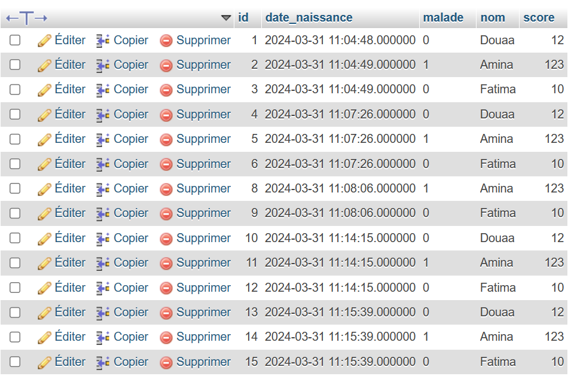
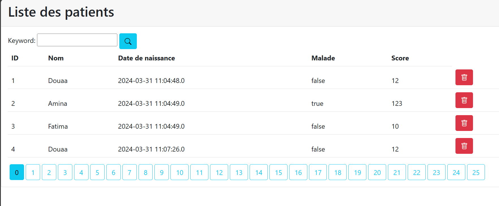
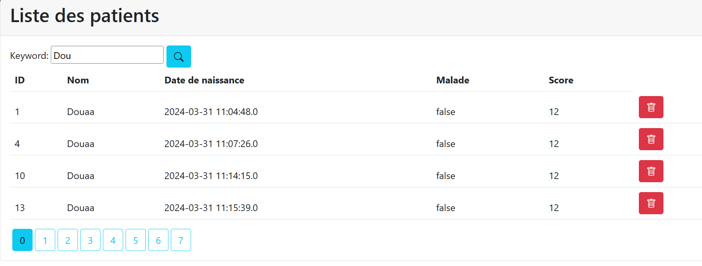
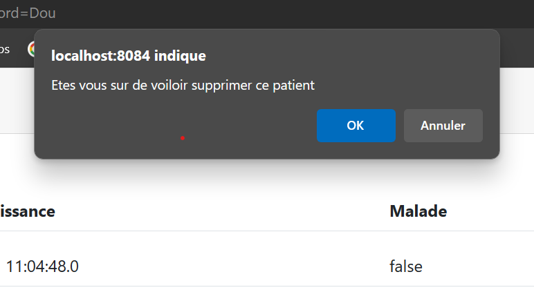

<h1>Compte rendu de l'activité Spring MVC Thymeleaf (Patients)</h1>
<h3>Description du projet</h3>

Dans ce projet j'ai créé trois packages:

<ul>
<li>entities: ce package contient la classe patient qui me servira de table</li>
<li>repository: ce package contient l'inteface JPA qui va me permettre 
de manipuler la table Patient</li>
<li>web : ce package contient mon controlleur qui contient trois actions, index, home et delete</li>

</ul>

puis j'ai créé une vue "patients.html" qui va me permettre d'afficher la liste des patients, de faire la pagination et la recharche
. j'ai utilisé le moteur de template " Thymeleaf" et j'ai intégré Bootstrap

En ce qui concerne la base de données j'ai lié le projet avec MySQL

<h3>Table Patients</h3>

<h3>la page web /index</h3>

la page affiche la liste des patients avec une fonctionnalité de recherche 
et une fonctionnalité de suppression et la pagination pour organiser la vue

<h3>Fonctionnalité de recherche</h3>

Tous les nom qui contiennent le keyword "Dou" s'affichent avec la pagination.

<h3>Fonctionnalité de suppression</h3>

Quand on souhaite supprimer un patient une alerte s'affiche 
contenant un message en cliquant sur ok on valide la suppression sinon on annule.
